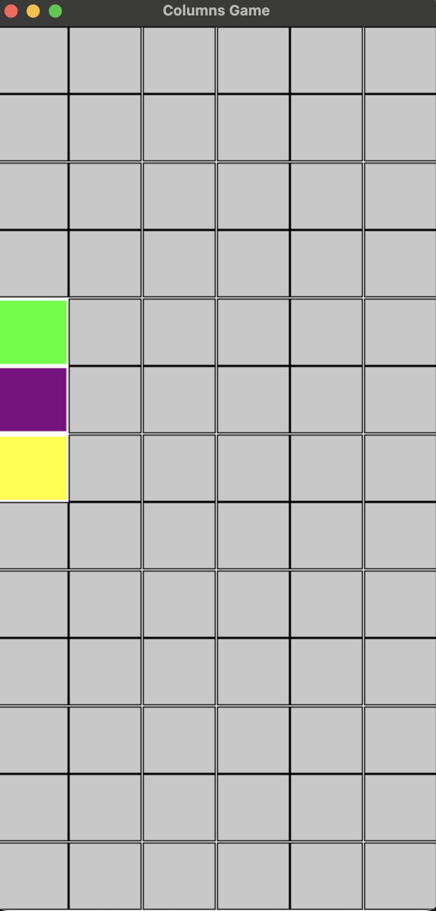
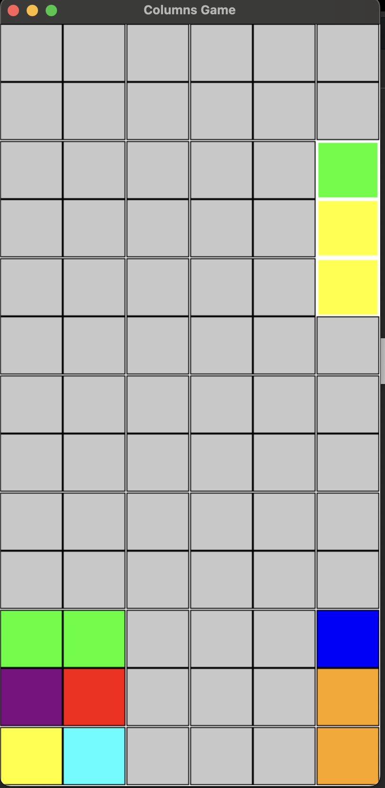
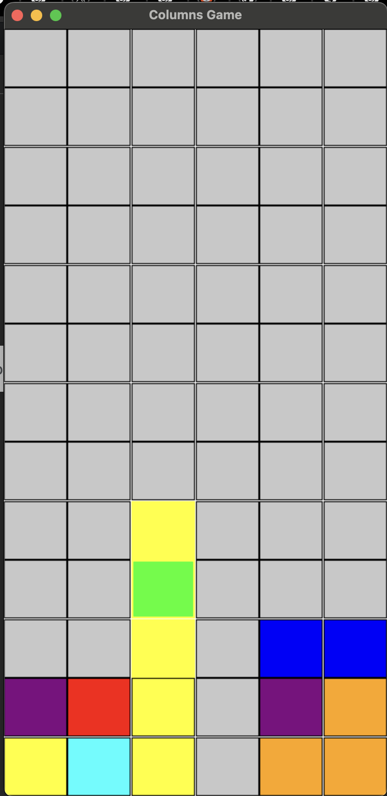

# columns-game
A Python implementation of the classic Columns game using pygame and tkinter, featuring real-time falling jewels, keyboard controls, and customizable gameplay

**Overview**

This project is a graphical implementation of the classic puzzle game Columns, built with Python using pygame and tkinter for visualization and interaction.

It expands on a prior console-based version by introducing a fully playable GUI, dynamic falling jewels, and keyboard controls—transforming the game into an engaging experience reminiscent of early 90s puzzle titles.

The project implements:

- Grid-based game mechanics cleanly separated from UI logic.

- Object-oriented programming to manage game state, rendering, and user interaction.

- pygame for real-time graphics and event handling.

- tkinter for GUI and display

- Randomly generate game pieces and manage timed game ticks.

**Features**

- Playable Columns Game  
  Jewels fall automatically, can be moved and rotated in real time, and freeze when they land.

- Randomized Fallers  
  New fallers spawn in random columns with random jewel colors.

- Keyboard Controls  

    - Left Arrow: Move faller left

    - Right Arrow: Move faller right

    - Spacebar: Rotate faller

- Visual Cues  
  Different jewel colors and optional visual effects indicate landing and freezing.

- Resizable Window  
  The game board scales with the window size, ensuring a responsive experience.

- Clean Separation of Logic and UI  
  All game mechanics are in separate modules from the graphical interface.

- Exception Handling  
  Invalid operations are safely handled with custom exceptions.

- Optional Enhancements  
  You can extend the game to include matching, scoring, preview of the next faller, or sound effects.

**How to Run**

_Prerequisites_
- Python 3.6+
- pygame installed
    - You can install pygame with:
    - pip install pygame

_Running the Game_

Execute the main script:

python3 columnsgamemain.py

The game window will open and start automatically.
Fallers will appear at the top and descend on their own. Use the keyboard controls to manipulate them as they fall.

_Controls_
- Left Arrow	Move faller left
- Right Arrow	Move faller right
- Spacebar	Rotate faller
- Close Window	Quit the game

_Project Structure_

- columns_logic.py        # Core game mechanics and state management
- columnsgamemain.py      # Graphical interface and main event loop
- errors.py               # Custom exception definitions

_Example Gameplay_

When you start the game:

- An empty 13x6 grid appears.

- A faller spawns in a random column.

- It drops one row per second.

- You can move or rotate the faller while it falls.

- When it lands, it freezes in place, and a new faller appears.

### Game Screenshots

&nbsp;&nbsp;&nbsp;&nbsp;&nbsp;&nbsp;&nbsp;&nbsp;&nbsp;&nbsp;&nbsp;&nbsp;&nbsp;&nbsp;&nbsp;&nbsp; 

**A fresh game board before any moves.**  &nbsp;&nbsp;&nbsp;&nbsp;&nbsp;&nbsp;&nbsp;&nbsp;&nbsp; **A faller in progress.**

**Jewels after freezing.**

_Notes_
- Game Mechanics: The project supports creating fallers, moving, rotating, and freezing them. Matching mechanics are optional and can be added as an enhancement.

- File Organization: Logic and GUI are fully separated for easier maintenance.

_Future Steps_

- Adding a preview of the next faller.

- Implementing matching and disappearing jewels.

- Keeping and displaying a score.

- Adding sounds or music (keeping total asset size under 1MB).

_Attribution_

- PyGame: Used for graphics and input handling.

- Tkinter: May be used for optional dialogs or settings.

  

_License_

This project is intended for educational use.
